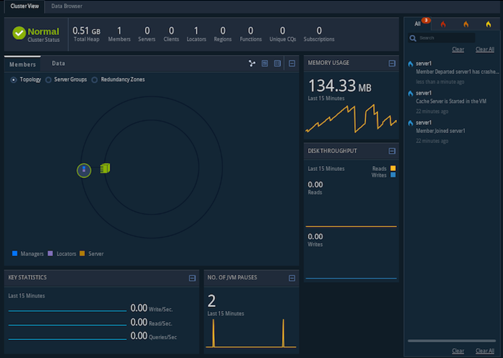

# Apache Geode in 15 Minutes or Less

## Step 1: Install Apache Geode
- Download Gemfire 9.15.4 from [VMWare](https://network.pivotal.io/products/pivotal-gemfire#/releases/1250048)
- Extract the .tgz file to a designated directory
- Edit the .bash_profile to set the environment
```
export GEMFIRE=/usr/local/vmware-gemfire-9.15.4
export PATH="$PATH:${GEMFIRE}/bin"
``` 
- Open a new terminal to verify if Gemfire is installed properly
```
gfsh version
```
or
```
gfsh version --full
```

## Step 2: Use gfsh to start a locator
In a terminal window, use the `gfsh` command line interface to start up a locator. Apache Geode gfsh (pronounced “jee-fish”) 
provides a single, intuitive command-line interface from which you can launch, manage, and monitor Apache Geode processes, 
data, and applications.

The *locator* is a Geode process that tells new, connecting members where running members are located and provides load balancing 
for server use. A locator, by default, starts up a JMX Manager, which is used for monitoring and managing a Geode cluster. 
The cluster configuration service uses locators to persist and distribute cluster configurations to cluster members.

1. Create a directory and change directories into it. `gfsh` saves locator and server working directories and log files in this 
location.
2. Start gfsh by typing `gfsh` at the command line
```
    _________________________     __
   / _____/ ______/ ______/ /____/ /
  / /  __/ /___  /_____  / _____  / 
 / /__/ / ____/  _____/ / /    / /  
/______/_/      /______/_/    /_/    9.15.4

Monitor and Manage VMware GemFire
gfsh>
```
3. At the `gfsh` prompt, type the start locator command and specify a name for the locator:
```
gfsh>start locator --name=locator1
Starting a Geode Locator in /Users/tampm/Research/Practicals/Gemfire/hello-world/locator1...
..........................
Locator in /Users/tampm/Research/Practicals/Gemfire/hello-world/locator1 on 192.168.0.184[10334] as locator1 is currently online.
Process ID: 36107
Uptime: 16 seconds
Geode Version: 9.15.4
Java Version: 13.0.2
Log File: /Users/tampm/Research/Practicals/Gemfire/hello-world/locator1/locator1.log
JVM Arguments: --add-exports=java.management/com.sun.jmx.remote.security=ALL-UNNAMED --add-exports=java.base/sun.nio.ch=ALL-UNNAMED --add-opens=java.base/java.lang=ALL-UNNAMED --add-opens=java.base/java.nio=ALL-UNNAMED -Dgemfire.enable-cluster-configuration=true -Dgemfire.load-cluster-configuration-from-dir=false -Dgemfire.launcher.registerSignalHandlers=true -Djava.awt.headless=true -Dsun.rmi.dgc.server.gcInterval=9223372036854775806
Class-Path: /usr/local/vmware-gemfire-9.15.4/lib/geode-core-9.15.4.jar:/usr/local/vmware-gemfire-9.15.4/lib/geode-server-all-9.15.4.jar

Successfully connected to: JMX Manager [host=192.168.0.184, port=1099]

Cluster configuration service is up and running.
```

## Step 3: Start Pulse
```
gfsh>start pulse
```
This command launches Pulse and automatically connects you to the JMX Manager running in the Locator. At the Pulse login 
screen, type in the default username `admin` and password `admin`.


## Step 4: Start a server
A Geode server is a process that runs as a long-lived, configurable member of a cluster. The Geode server is used 
primarily for hosting long-lived data regions and for running standard Geode processes such as the server in a 
client/server configuration.

Start the cache server:
```
gfsh>start server --name=server1 --server-port=40411
```
This commands starts a cache server named “server1” on the specified port of 40411.

## Step 5: Create a replicated, persistent region
In this step you create a region with the `gfsh` command line utility. Regions are the core building blocks of the Geode 
cluster and provide the means for organizing your data. The region you create for this exercise employs replication to 
replicate data across members of the cluster and utilizes persistence to save the data to disk.

1. Create a replicated, persistent region:
```
gfsh>create region --name=regionA --type=REPLICATE_PERSISTENT
Member  | Status | Message
------- | ------ | --------------------------------------
server1 | OK     | Region "/regionA" created on "server1"

Cluster configuration for group 'cluster' is updated.
```
Note that the region is hosted on server1.
2. Use the `gfsh` command line to view a list of the regions in the cluster.
```
gfsh>list regions
List of regions
---------------
regionA
```
3. List the members of your cluster. The locator and cache server you started appear in the list:
```
gfsh>list members
Member Count : 2

  Name   | Id
-------- | -----------------------------------------------------------------
locator1 | 192.168.0.184(locator1:36107:locator)<ec><v0>:41000 [Coordinator]
server1  | 192.168.0.184(server1:36271)<v1>:41002
```
4. To view specifics about a region, type the following:
```
gfsh>describe region --name=regionA
Name            : regionA
Data Policy     : persistent replicate
Hosting Members : server1

Non-Default Attributes Shared By Hosting Members  

 Type  |    Name     | Value
------ | ----------- | --------------------
Region | data-policy | PERSISTENT_REPLICATE
       | size        | 0
       | scope       | distributed-ack
```
In Pulse, click the green cluster icon to see all the new members and new regions that you just added to your cluster.

## Step 6: Manipulate data in the region and demonstrate persistence
1. Run the following put commands to add some data to the region:
```
gfsh>put --region=regionA --key="1" --value="one"
Result      : true
Key Class   : java.lang.String
Key         : 1
Value Class : java.lang.String
Old Value   : null

gfsh>put --region=regionA --key="2" --value="two"
Result      : true
Key Class   : java.lang.String
Key         : 2
Value Class : java.lang.String
Old Value   : null
```
2. Run the following command to retrieve data from the region:
```
gfsh>query --query="select * from /regionA"

Result     : true
startCount : 0
endCount   : 20
Rows       : 2

Result
------
two
one
```
3. Stop the cache server using the following command:
```
Stopping Cache Server running in /Users/tampm/Research/Practicals/Gemfire/hello-world/server1 on 192.168.0.184[40411] as server1...
Process ID: 36271
Log File: /Users/tampm/Research/Practicals/Gemfire/hello-world/server1/server1.log
........
```
4. Restart the cache server using the following command:
```
gfsh>start server --name=server1 --server-port=40411
```
5. Run the following command to retrieve data from the region again – notice that the data is still available:
```
gfsh>query --query="select * from /regionA"

Result     : true
startCount : 0
endCount   : 20
Rows       : 2

Result
------
two
one
```
Because regionA uses persistence, it writes a copy of the data to disk. When a server hosting regionA starts, the data 
is populated into the cache. Note that the result displays the values for the two data entries you created with the `put` 
commands prior to stopping the server.

## Step 7: Examine the effects of replication
In this step, you start a second cache server. Because regionA is replicated, the data will be available on any server 
hosting the region.
1. Start a second cache server:
```
gfsh>start server --name=server2 --server-port=40412
```
Run the describe region command to view information about regionA:
```
gfsh>describe region --name=regionA
Name            : regionA
Data Policy     : persistent replicate
Hosting Members : server2
                  server1

Non-Default Attributes Shared By Hosting Members  

 Type  |    Name     | Value
------ | ----------- | --------------------
Region | data-policy | PERSISTENT_REPLICATE
       | size        | 2
       | scope       | distributed-ack

```
Note that you do not need to create regionA again for server2. The output of the command shows that regionA is hosted on 
both server1 and server2. When gfsh starts a server, it requests the configuration from the cluster configuration service 
which then distributes the shared configuration to any new servers joining the cluster.
3. Add a third data entry:
```
gfsh>put --region=regionA --key="3" --value="three"
Result      : true
Key Class   : java.lang.String
Key         : 3
Value Class : java.lang.String
Old Value   : <NULL>
```
4. Open the Pulse application (in a Web browser) and observe the cluster topology. You should see a locator with two 
attached servers. Click the Data tab to view information about regionA.

5. Stop the first cache server with the following command
```
gfsh>stop server --name=server1
Stopping Cache Server running in /Users/tampm/Research/Practicals/Gemfire/hello-world/server1 on 192.168.0.184[40411] as server1...
Process ID: 36271
Log File: /Users/tampm/Research/Practicals/Gemfire/hello-world/server1/server1.log
........
```
Note that the data contains 3 entries, including the entry you just added.
6. Retrieve data from the remaining cache server
```
gfsh>query --query="select * from /regionA"
Result : true
Limit  : 100
Rows   : 3

Result
------
two
one
three
```
7. Add a fourth data entry:
```
gfsh>put --region=regionA --key="4" --value="four"
Result      : true
Key Class   : java.lang.String
Key         : 4
Value Class : java.lang.String
Old Value   : null
```
Note that only server2 is running. Because the data is replicated and persisted, all of the data is still available. But 
the new data entry is currently only available on server 2.
```
gfsh>describe region --name=regionA
Name            : regionA
Data Policy     : persistent replicate
Hosting Members : server2

Non-Default Attributes Shared By Hosting Members  

 Type  |    Name     | Value
------ | ----------- | --------------------
Region | data-policy | PERSISTENT_REPLICATE
       | size        | 4
       | scope       | distributed-ack
```
8. Stop the remaining cache server:
```
gfsh>stop server --name=server2
Stopping Cache Server running in /Users/tampm/Research/Practicals/Gemfire/hello-world/server2 on 192.168.0.184[40412] as server2...
Process ID: 36771
Log File: /Users/tampm/Research/Practicals/Gemfire/hello-world/server2/server2.log
......
```
## Step 8: Restart the cache servers in parallel
In this step you restart the cache servers in parallel. Because the data is persisted, the data is available when the 
servers restart. Because the data is replicated, you must start the servers in parallel so that they can synchronize 
their data before starting.
1. Start server1
Because regionA is replicated and persistent, it needs data from the other server to start and waits for the server to 
start:
```
gfsh>start server --name=server1 --server-port=40411
Starting a Geode Server in /Users/tampm/Research/Practicals/Gemfire/hello-world/server1...
..
Region /regionA has potentially stale data. It is waiting for another member to recover the latest data.
My persistent id:

  DiskStore ID: 0034100f-452b-4925-8de3-e9a38474574b
  Name: server1
  Location: /192.168.0.184:/Users/tampm/Research/Practicals/Gemfire/hello-world/server1/.

Members with potentially new data:
[
  DiskStore ID: 1fe8dd8e-d1b6-4019-ac92-fdedfbb8350e
  Name: server2
  Location: /192.168.0.184:/Users/tampm/Research/Practicals/Gemfire/hello-world/server2/.
]
Use the gfsh show missing-disk-stores command to see all disk stores that are being waited on by other members.
.......
```
2. In a second terminal window, change directories to the working directory and start gfsh:
```
Phams-MacBook-Pro:hello-world tampm$ gfsh
    _________________________     __
   / _____/ ______/ ______/ /____/ /
  / /  __/ /___  /_____  / _____  / 
 / /__/ / ____/  _____/ / /    / /  
/______/_/      /______/_/    /_/    9.15.4

Monitor and Manage VMware GemFire
```
3. Run the following command to connect to the cluster:
```
gfsh>connect --locator=localhost[10334]
Connecting to Locator at [host=localhost, port=10334] ..
Connecting to Manager at [host=192.168.0.184, port=1099] ..
Successfully connected to: [host=192.168.0.184, port=1099]

You are connected to a cluster of version 9.15.4.
```
4. Start server2
```
gfsh>start server --name=server2 --server-port=40412
```
When server2 starts, note that server1 completes its start up in the first gfsh window:
```
Server in /Users/tampm/Research/Practicals/Gemfire/hello-world/server1 on 192.168.0.184[40411] as server1 is currently online.
Process ID: 36931
Uptime: 1 minute 3 seconds
Geode Version: 9.15.4
Java Version: 13.0.2
Log File: /Users/tampm/Research/Practicals/Gemfire/hello-world/server1/server1.log
JVM Arguments: --add-exports=java.management/com.sun.jmx.remote.security=ALL-UNNAMED --add-exports=java.base/sun.nio.ch=ALL-UNNAMED --add-opens=java.base/java.lang=ALL-UNNAMED --add-opens=java.base/java.nio=ALL-UNNAMED -Dgemfire.default.locators=192.168.0.184[10334] -Dgemfire.start-dev-rest-api=false -Dgemfire.use-cluster-configuration=true -XX:OnOutOfMemoryError=kill -KILL %p -Dgemfire.launcher.registerSignalHandlers=true -Djava.awt.headless=true -Dsun.rmi.dgc.server.gcInterval=9223372036854775806
Class-Path: /usr/local/vmware-gemfire-9.15.4/lib/geode-core-9.15.4.jar:/usr/local/vmware-gemfire-9.15.4/lib/geode-server-all-9.15.4.jar
```
5. Verify that the locator and two servers are running:
```
gfsh>list members
Member Count : 3

  Name   | Id
-------- | -----------------------------------------------------------------
locator1 | 192.168.0.184(locator1:36107:locator)<ec><v0>:41000 [Coordinator]
server1  | 192.168.0.184(server1:36931)<v5>:41002
server2  | 192.168.0.184(server2:37005)<v6>:41003
```
6. Run a query to verify that all the data you entered with the put commands is available:
```
gfsh>query --query="select * from /regionA"
Result : true
Limit  : 100
Rows   : 4

Result
------
two
one
three
four
```
7. Stop server2 with the following command:
```
gfsh>stop server --dir=server2
Stopping Cache Server running in /Users/tampm/Research/Practicals/Gemfire/hello-world/server2 on 192.168.0.184[40412] as server2...
Process ID: 37005
Log File: /Users/tampm/Research/Practicals/Gemfire/hello-world/server2/server2.log
.......
```
8. Run a query to verify that all the data you entered with the `put` commands is still available:
```
gfsh>query --query="select * from /regionA"
Result : true
Limit  : 100
Rows   : 4

Result
------
two
one
three
four
```
## Step 9: Shut down the system including your locators
To shut down your cluster, do the following:
1. In the current gfsh session, stop the cluster:
```
gfsh>shutdown --include-locators=true
```
2. When prompted, type ‘Y’ to confirm the shutdown of the cluster.
```
As a lot of data in memory will be lost, including possibly events in queues, do you really want to shutdown the entire distributed system? (Y/n): Y
Shutdown is triggered

gfsh>
No longer connected to 192.168.0.184[1099].
```
3. Type `exit` to quit the gfsh shell.
```
gfsh>exit
```


## Reference:
Apache Geode in 15 Minutes or Less - https://geode.apache.org/docs/guide/114/getting_started/15_minute_quickstart_gfsh.html